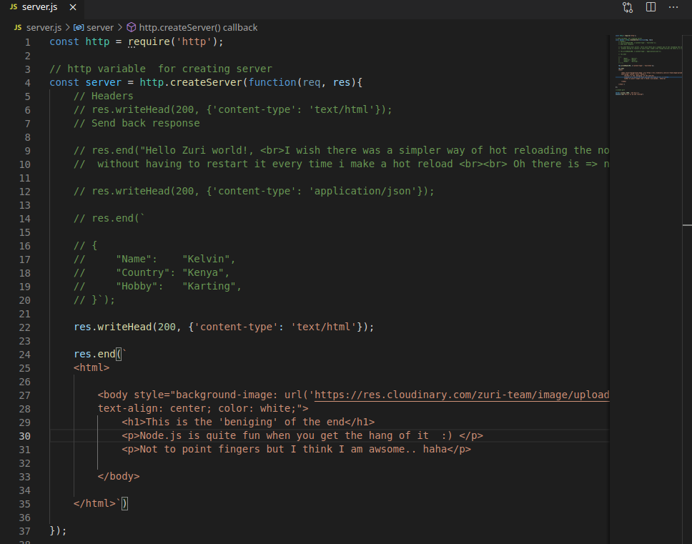

# simple-node-server
This is a demo of a simple node Zuri nodejs classes. 

# Screenshots of my work!! 

## Code for simple message

## Results for simple message

#
#
#

## Code for Json object 

## Results for Json object 

#
#
#

## Code for simple web page.

## Results simple web page.

